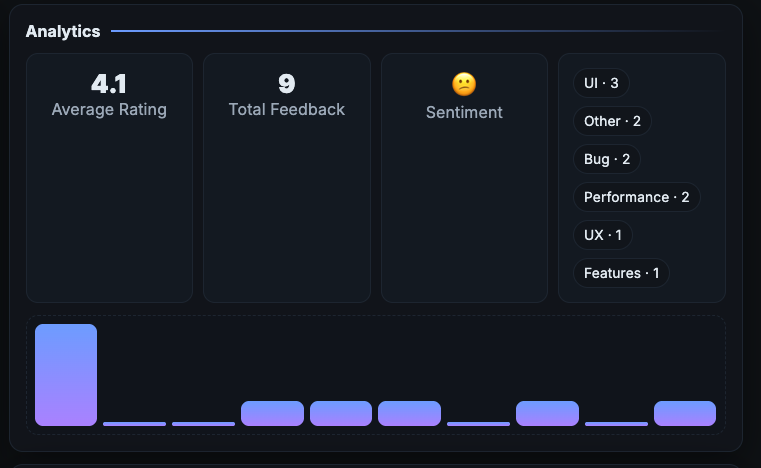
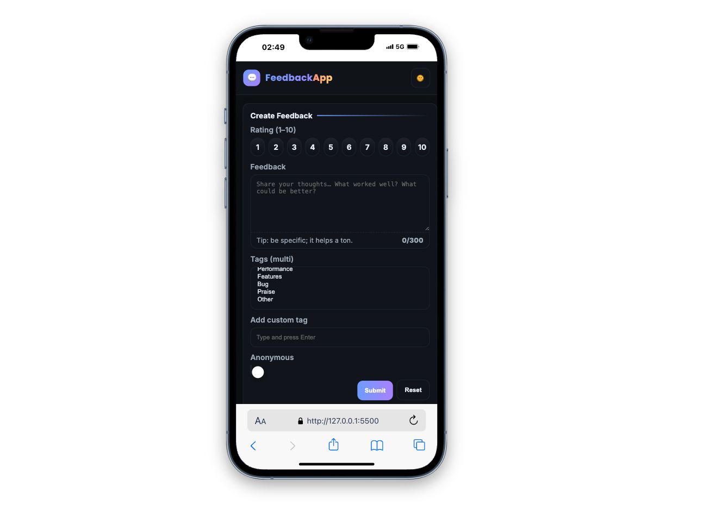

# Feedback Application

A comprehensive web-based Feedback Application that allows users to submit ratings, provide textual feedback, categorize feedback, view all submissions, and analyze statistics. The app also includes a modern, responsive design with light and dark mode support.

---

## Table of Contents

- [Features](#features)
- [Installation](#installation)
- [Usage](#usage)
- [Technologies Used](#technologies-used)
- [Screenshots](#screenshots)
- [Contributing](#contributing)
- [License](#license)

---

## Features

The Feedback Application comes with the following functionalities:

### 1. User Rating

- Users can rate on a scale from 1 to 10.
- The rating system supports quick selection and visual highlighting.

### 2. Feedback Message

- Users can enter detailed textual feedback.
- Input validation ensures meaningful feedback submission.

### 3. Feedback Categories

- Feedback can be assigned to specific categories (e.g., UI, Performance, Features).
- Makes it easier to filter and analyze feedback.

### 4. Feedback List

- Displays a list of all submitted feedback.
- Includes rating, message, category, and submission timestamp.
- Supports clean and organized layout for easy browsing.

### 5. Feedback Statistics

- Calculates average rating dynamically.
- Shows total number of feedback submissions.
- Displays category-wise statistics for better insights.

### 6. Theme Toggle (Light/Dark Mode)

- Users can switch between light and dark themes.
- Smooth transition between themes for enhanced user experience.

### 7. Responsive Design

- Fully responsive UI for desktop, tablet, and mobile devices.
- Modern design with clear typography and intuitive layout.

### 8. User-Friendly UI

- Modern form design with hover and focus effects.
- Smooth scrolling and aesthetic color scheme.

### 9. Filtering Feedback besed on likes and dislikes and category

- Users can filter feedback based on likes and dislikes and category.

### 10. Tag your feedback with list options

- you can tag your given feedback from this tags
<table>
    <th>Tags</th>
    <tr>
        <td><a>UI</a></td>
        <td><a>UX</a></td>
        <td><a>Performance</a></td>
        <td><a>Features</a></td>
        <td><a>Bug</a></td>
        <td><a>Praise</a></td>
        <td><a>Others</a></td>
    </tr>
</table>

### 11. You can give feedback with anonymous mode without giving your name

- Users can give feedback anonymously without providing their name.

### 12. Real time Analytics

## 

### 13. mobile first design



## Installation

1. Clone the repository:

```bash
git clone https://github.com/KALYANIHF/feedbackApp.git
```

2. Navigate to the project directory:

```bash
cd feedback-app
```

3. Run through any js package manger like npm, yarn, pnpm, bun to install dependencies: <i>( i use bun because it fast more than any other choices in the market )</i>

```bash
bun i
```

OR

```bash
bun install
```

OR

```bash
npm install
```

OR

```bash
yarn install
```

OR

```bash
pnpm install
```

4. To Run the application use the following command: <i>( here i am using bun you can use any other one as above just replace bun with your prefer dependency package manager )</i>

```bash
bun run dev
```

---

## Usage

1. Submit Feedback

   - Select a rating (1–10).
   - Enter feedback text.
   - Choose a category.
   - Click "Submit".

2. View Feedback

   - Browse the feedback list to see all submissions.

3. Analyze Statistics

   - Check average ratings.
   - Review category-wise insights.

4. Toggle Theme

   - Switch between light and dark mode using the theme toggle button.

---

## Technologies Used

- JSX – JavaScript syntax and features
- HTMl - Structured and semantic markup
- CSS3 – Modern styling and responsive layout
- JavaScript – Dynamic UI updates and statistics calculation
- React – JavaScript library for building user interfaces
- Vite – Modern build tool for JavaScript and CSS
- ESLint – JavaScript linter for code quality
- Prettier – Code formatter for consistent code style
- Jest – JavaScript testing framework for unit testing

---

## Screenshots


---

## Contributing

We welcome contributions to improve this app:

1. Fork the repository.
2. Create a new branch: `git checkout -b feature-name`
3. Make your changes and commit: `git commit -m 'Add new feature'`
4. Push to the branch: `git push origin feature-name`
5. Submit a Pull Request.

---

## License

This project is licensed under the MIT License.

---

## Author

**Souvik Mondal** – Senior Software Engineer

- Passionate about building interactive web applications
- Experienced in front-end, JavaScript frameworks, and DevOps
